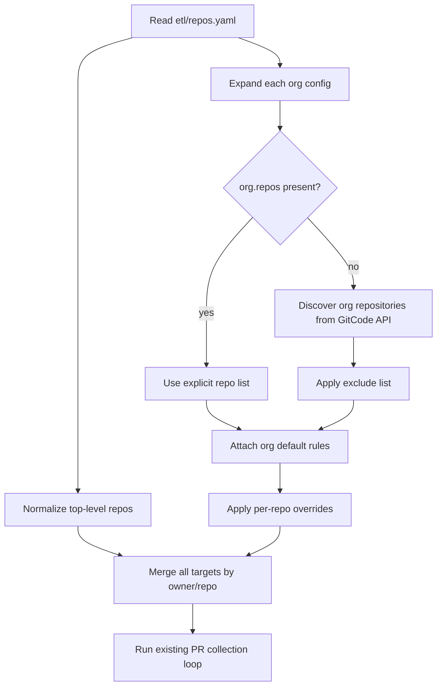

# Org-Level Repo Discovery Plan

> Historical note: this plan documents the transition period before the legacy collector was fully removed. See `docs/current-architecture.md` for the current single-pipeline architecture.

## Overview

Extend the ETL configuration model in `etl/repos.yaml` so an organization entry can act as a default rule source for every repository under that organization. When `orgs[].repos` is omitted, the collector should discover all accessible repositories for that organization at runtime, apply organization-level rules by default, respect `exclude`, and allow per-repository overrides without breaking existing explicit repository configuration. (see origin: `docs/brainstorms/2026-04-12-org-level-repo-discovery-requirements.md`)

## Problem Frame

The current collector only uses `orgs` as a rule-sharing convenience; it still requires maintainers to enumerate every `owner/repo` in `etl/repos.yaml`. That creates ongoing maintenance cost and misses newly added repositories. The change is limited to the ETL path in `etl/scripts/collect-gitcode.ts`; the legacy static collector under `config/repositories.yml` and `scripts/collector.js` remains out of scope. (see origin: `docs/brainstorms/2026-04-12-org-level-repo-discovery-requirements.md`)

## Requirements Trace

- R1. Treat an org entry without `repos` as an instruction to discover and analyze every repository under that organization.
- R2. Apply organization-level `rules` to discovered repositories by default.
- R3. Support an organization-level `exclude` list using full `owner/repo` identifiers.
- R4. Preserve current explicit `orgs[].repos` behavior.
- R5. Preserve current top-level `repos:` behavior.
- R6. Deduplicate repositories that are targeted through multiple config paths.
- R7. Allow per-repository rule overrides or supplements on top of organization defaults.
- R8. Make override precedence explicit and deterministic.
- R9. Skip inaccessible repositories without failing the entire organization run.
- R10. Emit clear output when discovery returns nothing or fails partially.
- R11. Keep downstream data/index compatibility unchanged.

## Scope Boundaries

- No changes to `config/repositories.yml` or `scripts/collector.js`.
- No attempt to add discovery-result caching beyond the current per-run ETL flow.
- No multi-level inheritance across organizations.
- No UI changes; this is ETL/configuration work only.

## Context & Research

### Relevant Code and Patterns

- `etl/scripts/collect-gitcode.ts` currently owns config loading, repo targeting, pagination, and index/data writes in one file.
- `etl/repos.yaml` already models `orgs[].rules` and explicit `orgs[].repos`, so the new behavior should extend that format rather than invent a parallel config system.
- `test/analyzer.test.js` shows the repo currently uses `node:test` with lightweight fixture objects; ETL tests should follow that style where possible.
- `src/utils/gitcodeCiEvents.js` is an example of extracting reusable pure logic out of the collector path; config resolution and repo-target expansion should follow the same pattern instead of growing `main()`.

### Institutional Learnings

- No relevant `docs/solutions/` artifacts were present in this repo.

### External References

- Skipped. The repo already contains the relevant ETL entry point and configuration surface; planning should verify GitCode API details during implementation rather than speculate here.

## Key Technical Decisions

- Extract config parsing and target-repo expansion into testable helpers instead of embedding discovery logic directly inside `main()`. This limits regression risk in the monolithic collector file.
- Use implicit discovery semantics: when `orgs[].repos` is absent, discover; when it is present, keep existing explicit behavior. This matches the origin decision and avoids a new boolean flag.
- Model per-repository exceptions as an explicit override map keyed by full `owner/repo`, so the merge and dedupe rules remain deterministic.
- Keep the final collector loop keyed by canonical `owner/repo` strings. That preserves index compatibility and makes dedupe a single responsibility.
- Treat org discovery failures as partial failures by default: log them, skip inaccessible repos, and continue processing the rest of the organization.

## Open Questions

### Resolved During Planning

- How should discovery be activated: implicitly or via a new flag? Resolved to implicit activation when `orgs[].repos` is omitted.
- Should exclusions be supported? Resolved to yes, using full `owner/repo` identifiers.
- Should org defaults allow repo-level exceptions? Resolved to yes, via deterministic per-repo override entries.

### Deferred to Implementation

- Which GitCode API endpoint is the best fit for enumerating organization repositories, and what pagination/permission behavior it has in practice.
- Whether per-repo overrides should replace organization rules entirely or merge by default with an opt-out; implementation should choose one documented behavior and cover it with tests.
- Whether empty discovery results should be surfaced as warnings, informational logs, or hard errors when the org is known but inaccessible.

## High-Level Technical Design

> *This illustrates the intended approach and is directional guidance for review, not implementation specification. The implementing agent should treat it as context, not code to reproduce.*

## Implementation Units

- [ ] **Unit 1: Normalize Config Model**

**Goal:** Define a configuration shape that can express org-level discovery, exclusions, and per-repo overrides without breaking current YAML.

**Requirements:** R1, R3, R4, R5, R7, R8

**Dependencies:** None

**Files:**
- Modify: `etl/scripts/collect-gitcode.ts`
- Modify: `etl/repos.yaml`
- Test: `test/collect-gitcode-config.test.js`

**Approach:**
- Introduce explicit TypeScript interfaces for optional `orgs[].repos`, `orgs[].exclude`, and per-repo override records.
- Move config loading and normalization into reusable helpers that return a canonical target-repo model keyed by full `owner/repo`.
- Keep the fallback `TARGET_REPOS` path intact and normalize it into the same canonical model.

**Patterns to follow:**
- `src/utils/gitcodeCiEvents.js` for extracting pure helper logic
- `test/analyzer.test.js` for lightweight `node:test` structure

**Test scenarios:**
- Happy path: org config with explicit `repos` preserves current targeting behavior.
- Happy path: top-level `repos:` and org-derived repos merge into one deduplicated target map.
- Edge case: `exclude` removes only exact `owner/repo` matches.
- Edge case: repo override entry for one repository does not affect sibling repositories in the same org.
- Error path: malformed org config is rejected or surfaced clearly rather than silently producing wrong targets.

**Verification:**
- The collector can build a canonical repo-target map from legacy and new YAML shapes before any network calls happen.

- [ ] **Unit 2: Discover Organization Repositories**

**Goal:** Expand organization entries without explicit `repos` into a concrete repository list using GitCode APIs, then feed the existing collection loop.

**Requirements:** R1, R2, R3, R6, R9, R10, R11

**Dependencies:** Unit 1

**Files:**
- Modify: `etl/scripts/collect-gitcode.ts`
- Test: `test/collect-gitcode-discovery.test.js`

**Approach:**
- Add a dedicated GitCode repository-discovery helper that paginates organization repositories and returns canonical `owner/repo` names.
- Apply `exclude` before the final dedupe pass so skipped repositories never enter downstream processing.
- Preserve the existing per-repo processing and index-writing path after target expansion; the new behavior should stop at target selection, not rewrite the collector pipeline.
- Log partial failures and empty results with enough detail to distinguish discovery issues from “no repos matched”.

**Technical design:** *(directional only)*
- Resolve org -> repo list
- Merge org defaults with repo-specific overrides
- Dedupe against top-level `repos:`
- Iterate resolved targets through the existing PR collection flow unchanged

**Patterns to follow:**
- Existing `paginate()` pattern in `etl/scripts/collect-gitcode.ts`
- Existing index update flow in `etl/scripts/collect-gitcode.ts`

**Test scenarios:**
- Happy path: org without `repos` discovers multiple repos and attaches shared rules to each.
- Happy path: duplicate repo reached through top-level `repos:` and org discovery is processed once.
- Edge case: empty discovery result yields a clear log signal and no crash.
- Edge case: excluded repo is discovered upstream but not collected downstream.
- Error path: one repo or one page of discovery fails without aborting the rest of the organization.
- Integration: resolved targets continue to produce the same `data/index.json` repo keys as the legacy explicit path.

**Verification:**
- A resolved target set from org discovery can flow through collection without changing downstream data layout.

- [ ] **Unit 3: Lock Behavior with Tests and Example Config**

**Goal:** Make the new configuration semantics legible to maintainers and keep regressions visible.

**Requirements:** R4, R5, R7, R8, R10

**Dependencies:** Unit 1, Unit 2

**Files:**
- Modify: `etl/repos.yaml`
- Modify: `package.json`
- Test: `test/collect-gitcode-config.test.js`
- Test: `test/collect-gitcode-discovery.test.js`

**Approach:**
- Add representative example config entries to `etl/repos.yaml` showing implicit org discovery, explicit `exclude`, and one repo-level exception.
- If needed, adjust the test script so ETL-focused tests can run alongside the existing analyzer tests without introducing a separate runner.
- Prefer deterministic unit tests around config expansion and discovery-result merging over end-to-end network tests.

**Execution note:** characterization-first for the existing explicit-config path; new tests should prove that old YAML still resolves the same targets.

**Patterns to follow:**
- `test/analyzer.test.js` test style
- Existing `package.json` script simplicity

**Test scenarios:**
- Happy path: legacy explicit org config fixtures resolve identically before and after the refactor.
- Happy path: example implicit-discovery config resolves to discovered repos plus documented override behavior.
- Edge case: override precedence is stable and documented by assertions.
- Error path: unsupported mixed config shapes fail with actionable messages if the implementation chooses strict validation.

**Verification:**
- Maintainers can understand the new config shape from the checked-in example, and automated tests protect both legacy and new resolution paths.

## System-Wide Impact

- **Interaction graph:** This work changes only ETL configuration parsing, repo target expansion, and the target set feeding the existing PR collection loop.
- **Error propagation:** Discovery/network issues should be contained to organization expansion and reported as partial failures, not crash the full run unless configuration cannot be parsed at all.
- **State lifecycle risks:** Incorrect dedupe or override merging could cause double-processing or silently skipped repos; tests need to pin these behaviors.
- **API surface parity:** `data/index.json` and daily `data/*.json` outputs must remain keyed by canonical `owner/repo` strings so the frontend stays untouched.
- **Integration coverage:** Unit tests alone will not prove the chosen organization-repo listing endpoint semantics; one implementation-time manual verification against a real org is still needed.
- **Unchanged invariants:** The existing PR pagination, CI run reconstruction, retention trimming, and index-writing flows should remain behaviorally unchanged after target expansion.

## Risks & Dependencies

| Risk | Mitigation |
|------|------------|
| GitCode org-repo listing API differs from assumptions | Isolate discovery behind a helper and verify the endpoint early during implementation |
| Repo-level override semantics become too implicit | Pick one merge rule, document it in config examples, and lock it with tests |
| Collector regressions from editing a monolithic ETL file | Extract pure helpers and add tests before changing the main processing loop |
| Duplicate or skipped repos due to merge bugs | Use canonical `owner/repo` keys and explicit dedupe tests |

## Documentation / Operational Notes

- Update the checked-in `etl/repos.yaml` example to demonstrate the new implicit-discovery semantics.
- During implementation, manually verify one real organization run because endpoint permissions and pagination behavior cannot be fully inferred from the current codebase.

## Sources & References

- **Origin document:** `docs/brainstorms/2026-04-12-org-level-repo-discovery-requirements.md`
- Related code: `etl/scripts/collect-gitcode.ts`
- Related code: `etl/repos.yaml`
- Related code: `test/analyzer.test.js`
