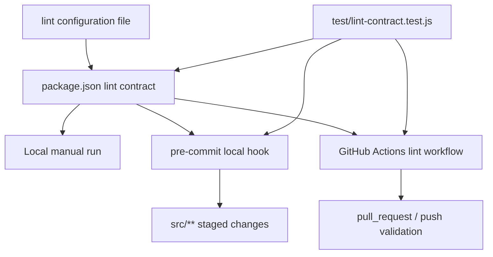

# Frontend Lint Gate Plan

## Overview

Add a frontend-only lint gate that is enforced through one canonical repo command, runs automatically through `pre-commit` for relevant changes, and is enforced in GitHub Actions on normal development events. The plan keeps the first version narrow: `src/` only, fail-fast only, and no extra orchestration layer unless it clearly reduces carrying cost. (see origin: `docs/brainstorms/2026-04-17-frontend-lint-gate-requirements.md`)

## Problem Frame

The repo already has frontend pages, shared utilities, and `node:test` coverage, but there is no checked-in frontend lint workflow. That means contributors do not have one reliable local quality gate, and CI does not currently enforce frontend style or correctness rules on pull requests or pushes. The goal is to add that missing contract without over-engineering a repo that is still primarily a small Node/Vite frontend plus ETL collector. (see origin: `docs/brainstorms/2026-04-17-frontend-lint-gate-requirements.md`)

## Requirements Trace

- R1. Define a frontend lint workflow for `src/`.
- R2. Fail on violations rather than silently rewriting files.
- R3. Run the same lint policy in CI.
- R4. Give contributors a clear local lint entrypoint.
- R5. Invoke the lint gate automatically through `pre-commit` for frontend changes.
- R6. Keep the first version minimal.
- R7. Include `lintrunner` only if it adds clear value over a direct linter command plus `pre-commit`.

## Scope Boundaries

- Only frontend application code under `src/` is in scope for enforcement in the first pass.
- ETL files under `etl/`, generated data under `public/data/`, and repo-wide hygiene linting are out of scope.
- Auto-fixing is out of scope for the initial gate.
- This plan does not expand into a broader test/build policy redesign beyond the lint gate needed for frontend development.

## Context & Research

### Relevant Code and Patterns

- `package.json` currently exposes `dev`, `collect`, `test`, `build`, and `preview`, but no `lint` script.
- `src/` is the only in-scope code surface for this change; the repo already separates frontend code from ETL and generated output cleanly.
- `.github/workflows/npm-publish-github-packages.yml` currently runs `npm test` only on release creation, so it is not a usable day-to-day frontend lint gate.
- `.github/workflows/collect-gitcode.yml` is ETL-specific and should remain isolated from frontend lint policy.
- Existing tests use `node:test` in `test/*.test.js`, which is a good fit for lightweight contract checks around package scripts and workflow alignment without introducing another test harness.

### Institutional Learnings

- No `docs/solutions/` artifacts were present in this repo.

### External References

- The official `pre-commit` docs describe `.pre-commit-config.yaml` as the project-level hook manifest and support local hooks that target a file subset via `files` or `types`, with `pre-commit run --all-files` as the standard manual verification path.
- The official `pre-commit` docs also note that hook entrypoints can be local and language-specific, which makes `pre-commit` a good thin trigger over an existing repo command rather than a reason to duplicate lint configuration.
- The `lintrunner` README describes it as a universal linter runner for large polyglot projects, driven by `.lintrunner.toml`, linter adapters, and a common protocol.
- The `lintrunner-action` README positions it as a uniform CI/local lint experience when a repo already commits to `lintrunner` as its orchestration layer.

### Planning Conclusions

- This repo has no strong local lint pattern today, so the plan should create one stable contract rather than add multiple overlapping entrypoints.
- `pre-commit` is justified because it directly satisfies the contributor-workflow requirement with low carrying cost.
- `lintrunner` is not justified in the first version: it introduces Python-based orchestration, adapter/config overhead, and a second source of lint truth for a repo that currently has only one scoped lint domain (`src/`).
- The stable contract should therefore be a repo-native frontend lint command in `package.json`, with `pre-commit` and CI both calling that same command.

## Key Technical Decisions

- Use one Node-native frontend lint command as the canonical contract.
  Rationale: this satisfies R1-R4 with the least duplication and creates one surface that local developers, pre-commit, and CI can all share.

- Scope the lint target explicitly to `src/`.
  Rationale: the origin document deliberately excludes ETL, generated data, and repo-wide hygiene rules from the first pass.

- Keep the first pass fail-only and do not enable fix mode in automation.
  Rationale: the user explicitly chose visible failures over automatic rewrites.

- Make `pre-commit` a thin trigger over the canonical lint command rather than a second policy definition site.
  Rationale: `pre-commit` should decide when to run, not redefine what “frontend lint” means.

- Add a dedicated development-event CI lint workflow instead of relying on the release-only workflow.
  Rationale: R3 requires an actual day-to-day CI gate for frontend work, and the existing release workflow does not cover pull requests or normal pushes.

- Defer `lintrunner` from v1 while preserving a migration path.
  Rationale: current research shows `lintrunner` is most valuable when one repo needs to coordinate multiple lint tools and languages through one orchestration layer. This repo does not yet have that shape. Keeping `npm run lint` as the stable contract preserves the option to introduce `lintrunner` later without changing contributor documentation or CI intent.

## Open Questions

### Resolved During Planning

- Should the first pass include `lintrunner`? Resolved to no for v1.
- Should CI lint piggyback on the release workflow? Resolved to no; use a dedicated development-event workflow.
- Should the lint boundary extend beyond `src/` in the first pass? Resolved to no.

### Deferred to Implementation

- Which exact ESLint rule set and plugin mix best fit the current React/Vite code with the least maintenance burden.
- Whether the canonical command should lint all `src/` files on every run or accept targeted paths when invoked from `pre-commit`, while still preserving one source of truth.
- Whether the CI workflow should also expose a reusable job pattern for future test/build gates, or stay intentionally lint-only in this pass.

## High-Level Technical Design

> Directional guidance for review, not implementation specification.

## Implementation Units

- [x] **Unit 1: Establish the Canonical Frontend Lint Contract**

**Goal:** Define one repo-native lint command and frontend lint configuration scoped to `src/`.

**Requirements:** R1, R2, R4, R6, R7

**Dependencies:** None

**Files:**
- Modify: `package.json`
- Create: `eslint.config.js`
- Test: `test/lint-contract.test.js`

**Approach:**
- Add the minimal frontend lint dependency set needed for the current React/Vite codebase.
- Introduce one canonical `lint` script in `package.json` that expresses the frontend-only boundary clearly.
- Keep the configuration explicit about `src/` scope and fail-only semantics.
- Avoid adding a formatter or a second JS quality tool in this pass unless the chosen linter requires it.

**Patterns to follow:**
- Existing repo-level contract style in `package.json`
- Existing lightweight test style in `test/*.test.js`

**Test scenarios:**
- Happy path: the repo exposes one documented lint script for frontend enforcement.
- Happy path: the lint configuration targets `src/` and excludes ETL/generated paths from first-pass enforcement.
- Regression: existing `test`, `build`, and `collect` scripts remain intact.
- Edge case: non-frontend changes do not implicitly broaden the lint scope.

**Verification:**
- A contributor can identify one stable frontend lint command without consulting multiple config files.

- [x] **Unit 2: Wire the Local Commit-Time Gate Through Pre-commit**

**Goal:** Make frontend lint run automatically for relevant commits without creating a second lint policy definition.

**Requirements:** R2, R4, R5, R6

**Dependencies:** Unit 1

**Files:**
- Create: `.pre-commit-config.yaml`
- Modify: `README.md`
- Test: `test/lint-contract.test.js`

**Approach:**
- Add a local `pre-commit` hook definition that delegates to the canonical repo lint contract.
- Scope the hook to frontend paths so unrelated ETL or generated-data commits do not pay the lint cost.
- Document the contributor setup and expected local behavior in `README.md`.
- Keep hook behavior fail-only; if a file violates lint rules, the commit should stop and surface the failure clearly.

**Patterns to follow:**
- Existing README setup-and-run style
- Requirement-driven scope boundaries from the origin doc

**Test scenarios:**
- Happy path: the checked-in `pre-commit` config points at the canonical lint entrypoint instead of redefining lint rules.
- Happy path: frontend-file commits are eligible for the hook.
- Regression: non-frontend paths do not trigger the frontend lint hook unnecessarily.
- Edge case: the documented local setup is sufficient for a contributor to understand how to enable the hook.

**Verification:**
- Commit-time enforcement is opt-in once per clone through standard `pre-commit` installation, but thereafter follows the same lint contract as manual runs.

- [x] **Unit 3: Add a Development-Event CI Lint Gate and Contract Checks**

**Goal:** Enforce the same frontend lint policy in GitHub Actions and guard against future drift between package scripts, pre-commit, and CI wiring.

**Requirements:** R1, R3, R4, R6, R7

**Dependencies:** Unit 1, Unit 2

**Files:**
- Create: `.github/workflows/frontend-lint.yml`
- Create: `test/lint-contract.test.js`
- Modify: `README.md`

**Approach:**
- Add a dedicated GitHub Actions workflow that runs on normal development events and invokes the canonical lint command.
- Keep the workflow focused on lint so it remains easy to reason about and does not entangle release publishing or ETL collection.
- Add a lightweight contract test that asserts the repo’s lint entrypoint remains aligned across `package.json`, `.pre-commit-config.yaml`, and the workflow definition.
- Document the CI behavior briefly so contributors know where frontend lint failures surface.

**Patterns to follow:**
- Existing Node 20 setup in `.github/workflows/*.yml`
- Existing `node:test` test style for low-friction contract coverage

**Test scenarios:**
- Happy path: the workflow runs the same lint command documented in `package.json`.
- Happy path: the contract test detects drift if pre-commit or CI points somewhere other than the canonical lint command.
- Regression: release publishing workflow remains focused on release events and is not repurposed as the primary frontend lint gate.
- Edge case: future script renames require one intentional contract update instead of silently desynchronizing local and CI behavior.

**Verification:**
- CI and local automation enforce the same frontend lint policy through one entrypoint, and drift between those entrypoints becomes detectable in automated tests.

## System-Wide Impact

- **Developer workflow:** contributors gain one explicit frontend lint command plus optional automatic pre-commit enforcement after local setup.
- **CI contract:** the repo gains a development-time frontend lint workflow instead of relying on the release-only pipeline.
- **Tooling surface:** frontend quality policy becomes explicit, while ETL and generated data remain intentionally out of scope.
- **Future extensibility:** the canonical command pattern keeps a clean seam for adding broader lint coverage later, including possible `lintrunner` adoption if the repo grows into multiple lint domains.

## Risks & Dependencies

| Risk | Mitigation |
|------|------------|
| Lint scope accidentally expands beyond `src/` and starts failing on ETL or generated files | Keep the lint config and pre-commit path filters explicit, and cover the contract with a lightweight test |
| `pre-commit` becomes a second policy definition layer | Make it call the canonical repo lint contract rather than re-declaring lint rules |
| CI and local lint behavior drift over time | Add `test/lint-contract.test.js` to assert alignment across package scripts, pre-commit, and workflow config |
| The first linter choice pulls in more maintenance than the repo needs | Prefer the smallest viable frontend lint stack and keep formatter/autofix policy out of scope |
| Deferring `lintrunner` is revisited later | Preserve `npm run lint` as the stable contract so orchestration can change later without changing contributor-facing semantics |

## Documentation / Operational Notes

- Document the frontend lint entrypoint and `pre-commit` setup in `README.md`.
- Keep `.github/workflows/npm-publish-github-packages.yml` focused on release events; do not overload it with the new day-to-day lint gate.
- During implementation, verify both the manual lint path and the CI workflow path before calling the feature complete.

## Sources & References

- **Origin document:** `docs/brainstorms/2026-04-17-frontend-lint-gate-requirements.md`
- Related code: `package.json`
- Related code: `src/App.jsx`
- Related workflow: `.github/workflows/collect-gitcode.yml`
- Related workflow: `.github/workflows/npm-publish-github-packages.yml`
- Related tests: `test/router-config.test.js`
- Related tests: `test/etl-data.test.js`
- External reference: https://pre-commit.com/index
- External reference: https://raw.githubusercontent.com/suo/lintrunner/main/README.md
- External reference: https://raw.githubusercontent.com/justinchuby/lintrunner-action/main/README.md
